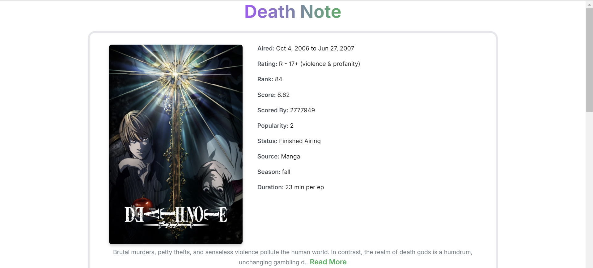
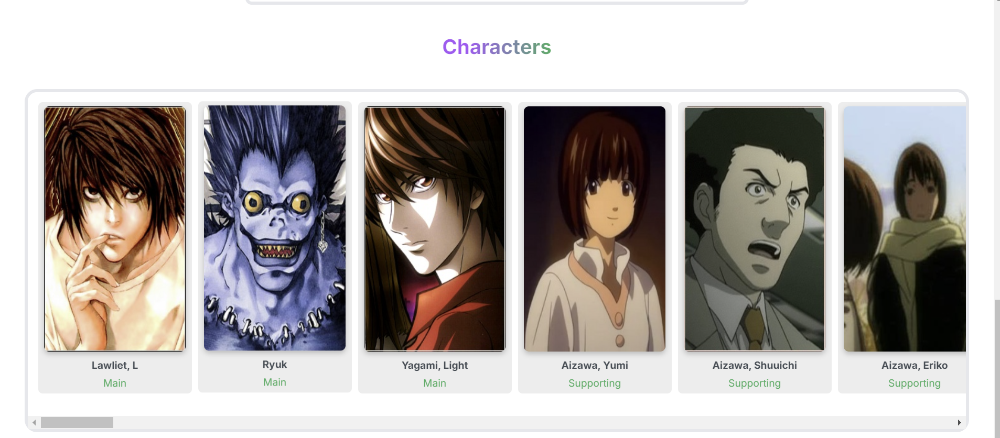

# Anime Info Website

[](https://anime-info.onrender.com/)

## Description
This website provides information about different anime, including popular, airing, and upcoming titles. Users can also search for specific anime using the search feature. The project was built using React.js, Jikan API, and CSS.


## Screenshots

### Home Page


### Click on anime 


### Watch trailer


### Check characters


### Explore any Character


## Installation

1. **Clone the repository:**
    ```bash
   git clone https://github.com/Aadil404/Anime-Info.git
   cd Anime-Info
2. **Install dependencies**

   ```bash
    npm install
3. **Run the application:**
    ```bash
    npm run dev
4. **Access the app:**

    The app will be running at `http://localhost:3000`.